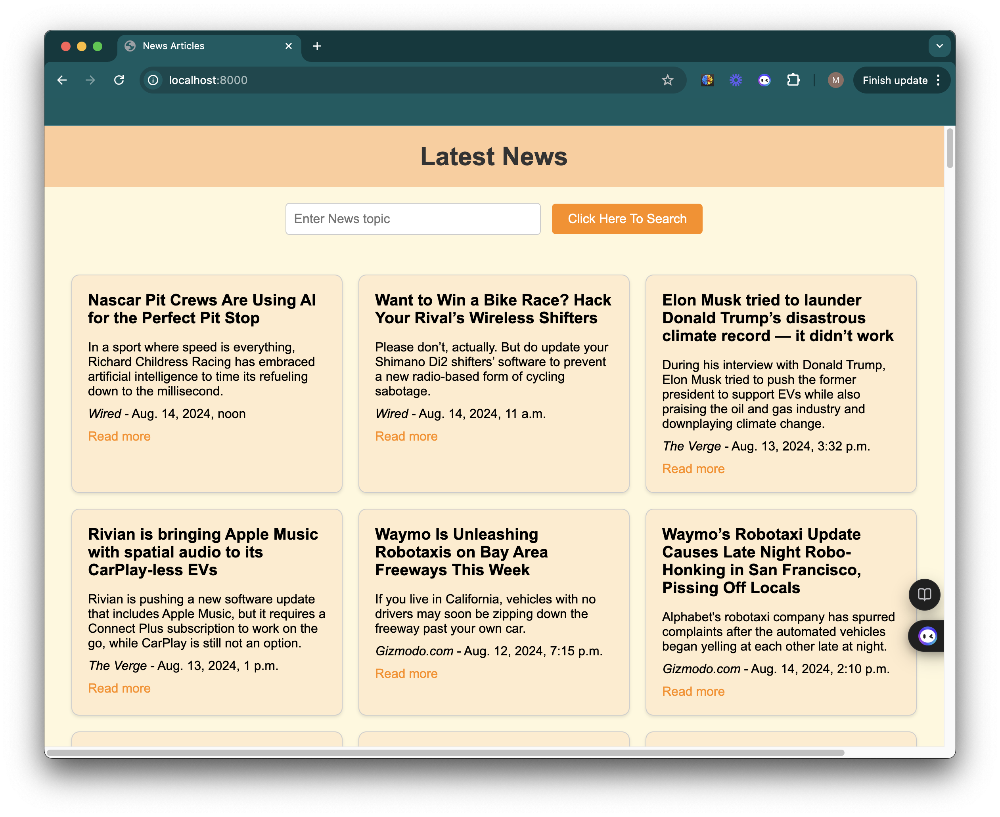
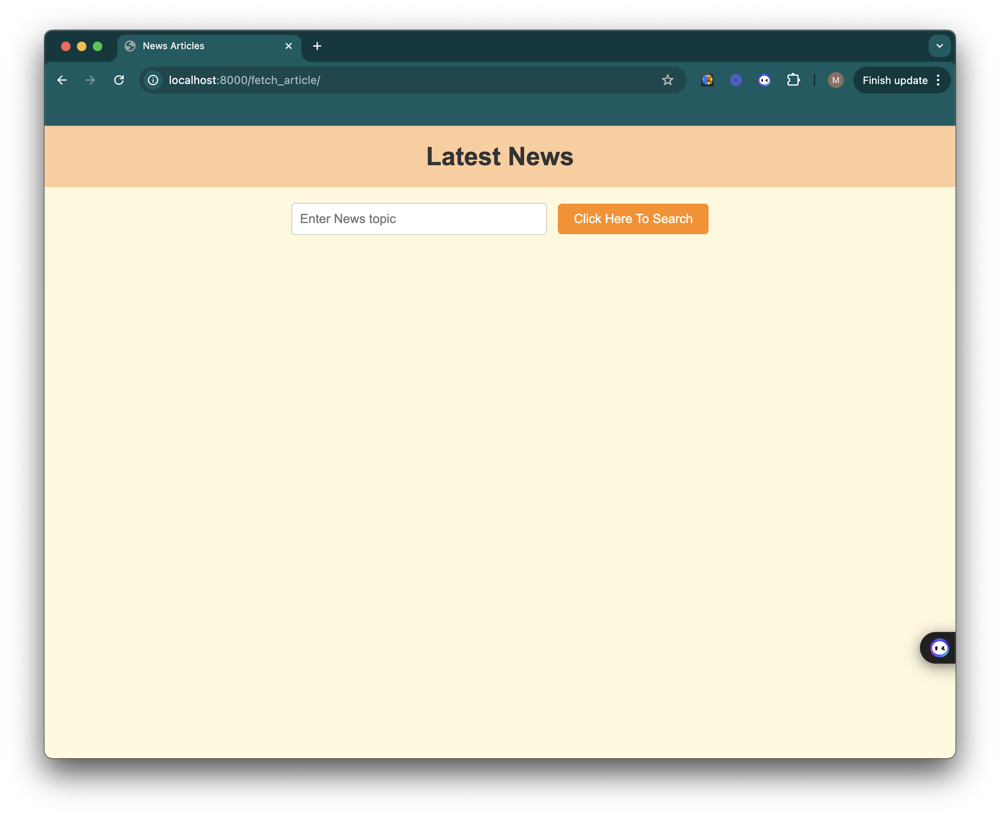
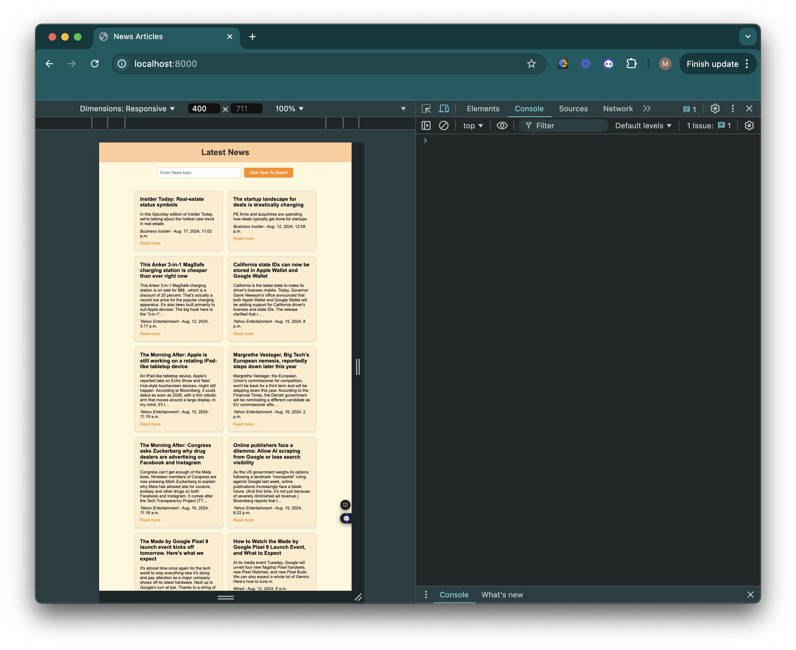

# ICS 2033: INTERNET APPLICATION PROGRAMMING FINAL PROJECT
This directory contains a News Aggregator Application, which is a Python-based (Django) project that collects and aggregates news articles from various sources.

# Main Function Points
1. Aggregates news articles from multiple sources
2. Provides a platform for users to access and read the latest news
3. Allows users to customize their news feed based on their preferences

# Technology Stack
1. Python - Django
2. HTML, CSS, Javascript
3. PostgreSQL

# How to start the app
1. Setup your PostgreSQL db and ensure it is up
2. Create a .env file with the following
```
POSTGRES_DB=
POSTGRES_USER=
POSTGRES_PASSWORD=''
POSTGRES_HOST=localhost
POSTGRES_PORT=5432
NEWS_API_KEY=''
SECRET_KEY=''
```
3. Run the following commands
```
python manage.py makemigrations
python manage.py migrate
python manage.py runserver
```

# Output
## Home page


## fetch_article page


## mobile-responsive page
